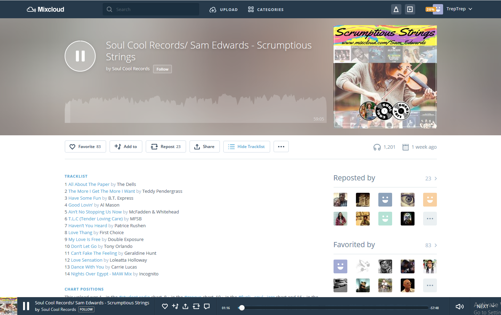

# Mixcloud (with) Tracklist (Web-Extension)

Displays tracklists on Mixcloud Website.
Extension supports current Mixcloud website (React/graphQL).

## Compatibility 
Extension build with Mozilla's WebExtensions API.
Compatible with Firefox (min v58), Chrome & any others browsers based on Webkit (like Vivaldi).

 - [Firefox Extension][firefox-install] : Don't work on mobile website. Have to work on it.
 - Google Chrome Extension : very soon (1/2 days)
 - IE: not tested

 
---

---

## Extension options
By default tracklist is shown. You can change it in option panel.

## Limitations:
- Mixcloud returns tracklist's datas only if you're logged.
- Don't work on mobile website. Have to work on it.

## Thanks
 - [Andrew Lawson](https://github.com/adlawson) for his previous Mixcloud Tracklist Extension (didn't fork it because Extension is full rewrited)

[firefox-install]: https://addons.mozilla.org/en-US/firefox/addon/mixcloud-with-tracklist/
[chrome-install]: TODO
