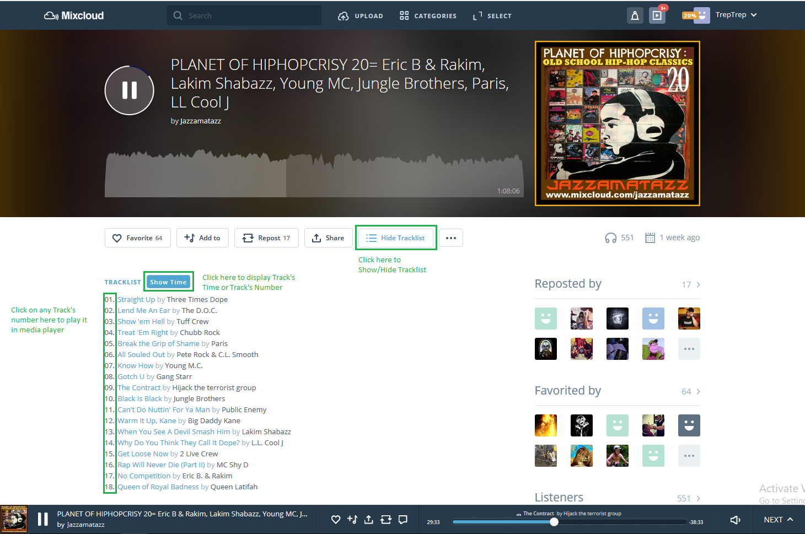

# Mixcloud (with) Tracklist (Web-Extension)

- Displays tracklists (with track's Number/Time on Mixcloud Website).
- You can play directly any track by clicking on track number/time
- Extension supports current Mixcloud website (React/graphQL).

## Compatibility 
Extension build with Mozilla's WebExtensions API.
Compatible with Firefox (min v58), Chrome & any others browsers based on Webkit (like Vivaldi).

 - [Firefox Extension][firefox-install]
 - [Google Chrome Extension][chrome-install]
 - IE: not tested.
 - Mobile website: Have to work on it (maybe one day?).

 
---
## Instructions

---

---

## Extension options
By default Track's Time is shown. You can change it in option panel to display Track's Number by default.

## Limitations:
### General Limitations
- Mixcloud returns tracklist's datas only if you're logged. Could happened that Mixcloud don't returns tracklist at all for few minutes. In that case, wait a little, and reload the page.
- Don't work on mobile website. Have to work on it (maybe one day?).
### Select Track Playing Limitations
- Select track playing in media player works only for track with timestamp available.
- Select a track doesn't add mix in media player. It should be already in it.

## Thanks
 - [Jean-Christophe Henry](http://www.oddsquid.com/) for icon's design.
 - [Andrew Lawson](https://github.com/adlawson) for his previous Mixcloud Tracklist Extension (didn't fork it because Extension is full rewrited)

[firefox-install]: https://addons.mozilla.org/en-US/firefox/addon/mixcloud-with-tracklist/
[chrome-install]: https://chrome.google.com/webstore/detail/mixcloud-with-tracklist/jgghogcekaldifaiifpnbfnpmmpiengb?hl=en-US&gl=FR
