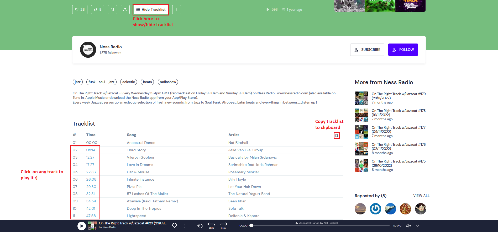

# IMPORTANT
Due to some changes on Mixcloud Website, 
this extension is currently broken.  
Fix release is scheduled for the end of January. See [here](https://github.com/trepDev/mixcloud-with-tracklist/issues/33)
for more details.

# Mixcloud (with) Tracklist (Web-Extension)

- Displays tracklists Mixcloud Website.
- You can play directly any track by clicking on track number/time
- You can copy tracklist to clipboard
- Extension supports current Mixcloud website (React/graphQL).

## Compatibility 
Extension build with Chrome's WebExtensions API.
Compatible with Firefox (min v58), Chrome & any others browsers based on Webkit (like Vivaldi, Edge...).

 - [Firefox Extension][firefox-install]
 - [Google Chrome Extension][chrome-install]
 - Mobile website: Have to work on it (maybe one day?).

 
---
## Instructions

---

## Extension options
By default tracklist is shown. You can change it in option panel.

## About Tracklist unavailable
If the "Tracklist unavailable" button appears, this is not an issue with this extension, but it probably means that mix 
uploader didn't provide it.

## Limitations:
### General Limitations
- Don't work on mobile website (m.mixcloud.com). Have to work on it (maybe one day?).
### Track Playing Limitations
- Playing Track in media player works only for tracks with timestamp available.
- Timestamps (for display & select) are only available once you launch mix in player. (Mixcloud API constraint)
- Due to Mixcloud audio data retrieval way, once a mix is played, you often have to wait 10/20 second for you first track choice
- Same if you click on reset mix.
- On Firefox, playing track is not totally stable, avoid selecting too many tracks in a short amount of time (ex: 4/5 click in less than 10 secondes).
Same as above, if selecting a track don't work, wait 10/20 second.

## Privacy Policy
No personal info is used/collected.

## Thanks
 - [Jean-Christophe Henry](https://jiss.tv/) for icon design.
 - [Andrew Lawson](https://github.com/adlawson) for his previous Mixcloud Tracklist Extension (didn't fork it because Extension is full rewrited)

[firefox-install]: https://addons.mozilla.org/en-US/firefox/addon/mixcloud-with-tracklist/
[chrome-install]: https://chrome.google.com/webstore/detail/mixcloud-with-tracklist/jgghogcekaldifaiifpnbfnpmmpiengb?hl=en-US&gl=FR
