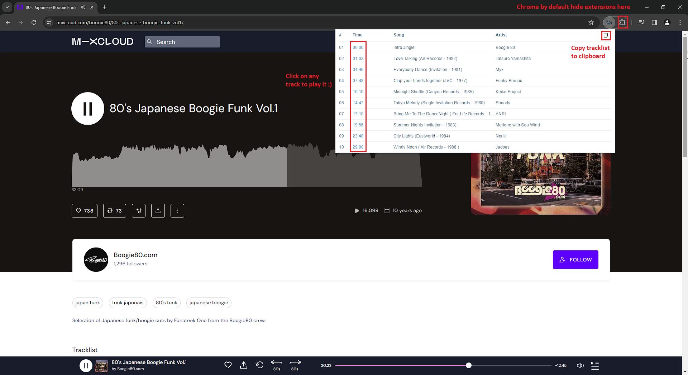

# Mixcloud (with) Tracklist (Web-Extension)

- Displays tracklists for Mixcloud Website. (You can display tracklists from multiple Mixcloud pages. The first one displayed will always be from the music player.)
- You can play any track directly by clicking on its timestamp.
- You can copy tracklist to clipboard

## Compatibility 
Extension build with Chrome's WebExtensions API.
Compatible with Firefox (min v58), Chrome & any others browsers based on Webkit (like Vivaldi, Edge...).

 - [Firefox Extension][firefox-install]
 - [Google Chrome Extension][chrome-install]
 - [Edge Extension][edge-install]
 - The mobile website is not compatible.

 
---
## Instructions

---

## Limitations:
### General Limitations
- Tracklists and timestamps are available only when the mix uploader has provided them.
- Don't work on mobile website (m.mixcloud.com). Mixcloud has limited its functionality, encouraging users to migrate to the mobile app.
Therefore, mobile website version is not scheduled for implementation.
### Track Playing Limitations
- Playing Track in media player works only for tracks with timestamp available.

## Privacy Policy
No personal info is used/collected.

## Thanks
 - [Jean-Christophe Henry](https://jiss.tv/) for icon design.
 - [Andrew Lawson](https://github.com/adlawson) for his previous Mixcloud Tracklist Extension (didn't fork it because Extension is full rewrited)

[firefox-install]: https://addons.mozilla.org/en-US/firefox/addon/mixcloud-with-tracklist/
[chrome-install]: https://chrome.google.com/webstore/detail/mixcloud-with-tracklist/jgghogcekaldifaiifpnbfnpmmpiengb?hl=en-US&gl=FR
[edge-install]: https://microsoftedge.microsoft.com/addons/detail/mixcloud-with-tracklist/kiacdpcggbfmlpgodnpmdildfgelpbae
